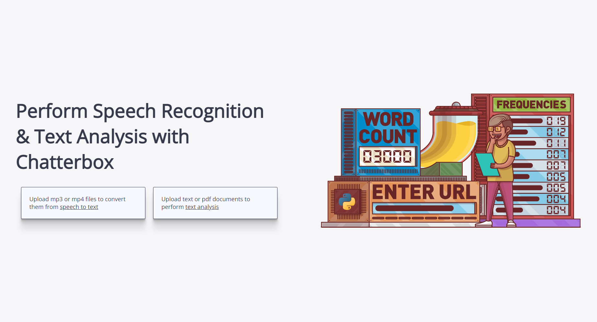

<h1 align="center" style="border-bottom: none">
    <b>Chatterbox</b>
</h1>

<p align="center">
    A speech-to-text & text analysis tool built using Flask, React, HuggingFace and Vosk.
</p>


<div align="center">

[](https://npmjs.com/package/express)
[](https://reactjs.org/)
[](https://www.typescriptlang.org/)
</div>

 

# Table of Contents
- [Introduction](#introduction)
- [Setup](#setup)
- [Getting Started](#getting-started)
- [Documentation](#documentation)

# Introduction
Chatterbox is a web application that is intended for local / offline purposes. It supports a React-Flask framework, and supports two main features:
- <b>Speech-To-Text Conversion</b> using Vosk Speech Recognition
    - This can be done by uploading `.mp3` or `.mp4` files
- <b>Text Analysis</b> using multiple NLP methods with HuggingFace Transformers models
    - This can be done by uploading `.txt` or `.pdf` files 

Chatterbox has been tested on Windows and Linux (Ubuntu 20.04 LTS)    
Chatterbox has also been successfully deployed on a Kubernetes cluster using Minishift.

# Setup
### For Windows Setup
Ensure the following softwares are downloaded
- [FFmpeg](https://www.ffmpeg.org/download.html)
- Github Desktop
- Node.js
- Python >3.8
- Vscode

<br/>

### For Linux Setup
```bash
$ sudo apt install git
$ sudo apt install python
$ sudo apt install ffmpeg
$ sudo snap install node --classic
```


# Getting Started
### 1. Download HuggingFace models (For Offline Use)

Download the `pytorch_model.bin` for each model and move each file to its respective `backend/models` folder

- [twitter-roberta-base-sentiment](https://huggingface.co/cardiffnlp/twitter-roberta-base-sentiment/tree/main) (sentiment analysis)
    - `backend/models/roberta-SA`
- [bart-large-cnn](https://huggingface.co/facebook/bart-large-cnn/tree/main) (summary)
    - `backend/models/bart-summary`
- [all-MiniLM-L6-v2](https://huggingface.co/sentence-transformers/all-MiniLM-L6-v2/tree/main) (topic modelling)
    - `backend/models/all-MiniLM-L6-v2`

### 2. Create a virtual environment & install Python dependencies for Flask backend

```c
cd backend       
python -m venv .venv

// ensure (.venv) is showing in ur command prompt, else run this command in the parent directory
.venv\scripts\activate          // For Windows
$ source .venv/bin/activate     // For Linux

pip install -r requirements.txt
pip install pytorch 
// some modules may need to be individually pip installed, check for missing modules & pip install respective modules
```

### 3. Install Node modules for React frontend
```
cd frontend      
npm install
```

### 4. Run both frontend and backend servers
```c
cd backend
flask run

cd frontend
npm start
```


# Documentation  
Individual documentation can be found for the following components:
-  Creating Shellscript for ChatterBox Quickstart (For Linux) located in `/ubuntu bash launcher` folder
- Audio Processing (Vosk) located in `/References/Audio_Processing.md`
- Natural Language Processing (NLP) located in `/References/NLP.md`
- React Frontend located in `/References/React.md`
