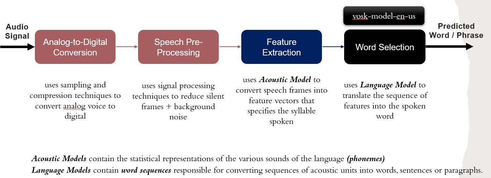

<h1 align="center" style="border-bottom: none">
    <b>Chatterbox Audio Processing Documentation</b>
</h1>

<p align="center">
    A text-to-speech & text analysis tool built using Flask, React, HuggingFace and Vosk
</p>

<div align="center">

[](https://npmjs.com/package/express)
[](https://reactjs.org/)
[](https://www.typescriptlang.org/)
</div>


# Table of Contents
- [Setup](#setup)
- [Understanding Automatic Speech Recognition](#understanding-vosk-speech-recognition)
- [Vosk Speech-To-Text](#vosk-speech-to-text)
- [References](#references)


# Setup

### 1. Install FFmpeg
<b>For Windows:</b> </br>
- Download FFmpeg from their [official site](https://www.ffmpeg.org/download.html)
- Refer to this [guide](https://www.wikihow.com/Install-FFmpeg-on-Windows) on how to install FFmpeg 

<b>For Linux:</b> 
```bash
$ sudo apt install ffmpeg
```

### 2. Install Vosk

```
pip install vosk
```

### 3. Download pre-trained Vosk language model
A list of avaliable pre-trained language models can be found [here](https://alphacephei.com/vosk/models). You should download the models and save them in the `/backend` directory.


# Understanding Automatic Speech Recognition
Vosk makes use of <b>Automatic Speech Recogntion (ASR)</b> to convert speech to text. A flowchart of how ASR works is shown below, which can be split into 4 main stages:

1. <b>Analog-to-Digital-Conversion:</b> converts analog voice to digital form with the help of sampling and quantization techniques
2. <b>Speech Pre-Processing:</b> Identification and reremoval of silent frames, as well as signal processing techniques to reduce/eliminate sound + divide into speech frames
3. <b>Feature Extraction:</b> conversion of speech frames into feature vector that specifies the phoneme / syllable spoken using acoustic models. In essence, we are trying to break the audio down into individual syllables for the computer to easily understand
4. <b>Word Selection:</b> the sequence of phonemes/features is translated into the spoken word using a language model


# Vosk Speech-To-Text
 Given that Vosk only accepts input files of wav format, we first use the FFmpeg pipeline to convert the mp3 or mp4 files into wav.

```python
import subprocess

def convert_ffmpeg(audio_filename):
    
    if audio_filename[-3:] == 'mp4':
        audio_wavfile = audio_filename.replace(".mp4", ".wav")
    else:
        audio_wavfile = audio_filename.replace(".mp3", ".wav")
    # convert mp4 or mp3 files to wav format 
    subprocess.call('ffmpeg -i ' + audio_filename + ' -vn -acodec pcm_s16le -ar 44100 -ac 2 ' + audio_wavfile + ' -y', shell=True)
```

Subsequently, we load the Vosk english model to process the audio files. This is found in `/python/example/chatterbox_vosk.py`, whereby `/python` is the directory that contains the Python module for Vosk. To account for large audio files, we adopt a buffering approach by breaking down the file into chunks of 4000 frames each and loop through them to process them individually before finally extracting and combining to form an overall JSON result.

```python
def chatterbox_vosk(audio_file):
    SAMPLE_RATE = 16000

    # load Vosk model by specifying the specific Vosk model name
    model = Model("vosk-model-en-us")
    rec = KaldiRecognizer(model, SAMPLE_RATE)

    outputresult = []
    with subprocess.Popen(["ffmpeg", "-loglevel", "quiet", "-i",
                                audio_file,
                                "-ar", str(SAMPLE_RATE) , "-ac", "1", "-f", "s16le", "-"],
                                stdout=subprocess.PIPE) as process:

        while True:
            # buffering process to break into chunks of 4000 frames
            data = process.stdout.read(4000)
            if len(data) == 0:
                break
            if rec.AcceptWaveform(data):
                finalresult = json.loads(rec.Result())
                print("Result_: ", finalresult)
                outputresult.append(finalresult.get("text", ""))
        
        # combine overall JSON result
        totalresult = json.loads(rec.FinalResult())
        outputresult.append(totalresult.get("text", ""))
        print("Final_Result: ", outputresult)

    return outputresult
```


# References
- [Vosk API](https://alphacephei.com/vosk/)
- [A guide to using Vosk for large audio files](https://towardsdatascience.com/transcribe-large-audio-files-offline-with-vosk-a77ee8f7aa28)