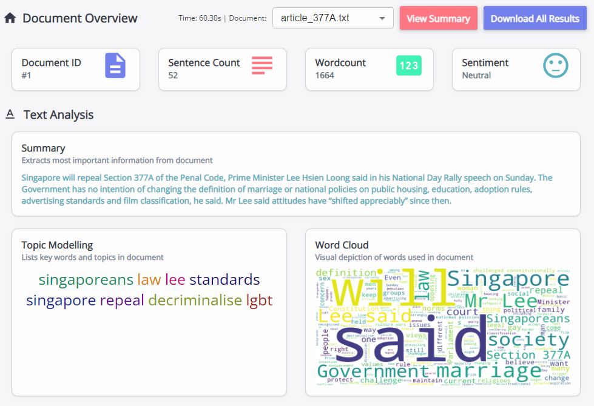
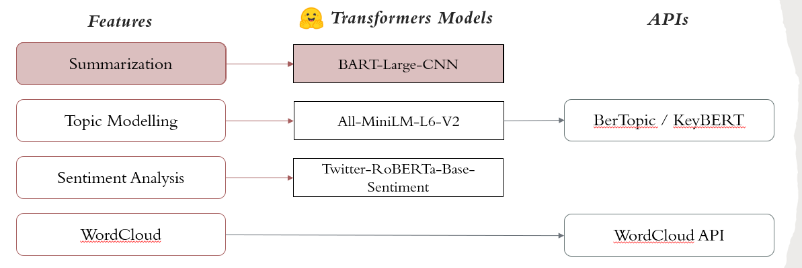
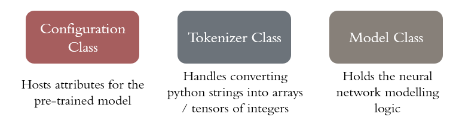
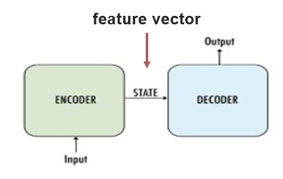
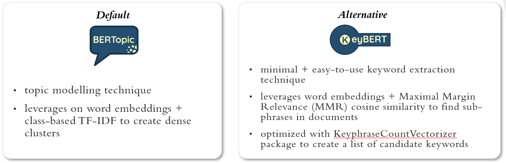

<h1 align="center" style="border-bottom: none">
    <b>Chatterbox NLP Documentation</b>
</h1>

<p align="center">
    A text-to-speech & text analysis tool built using Flask, React, HuggingFace and Vosk
</p>

<div align="center">

[](https://npmjs.com/package/express)
[](https://reactjs.org/)
[](https://www.typescriptlang.org/)
</div>



# Table of Contents
- [Setup](#setup)
- [Understanding NLP and HuggingFace](#understanding-nlp-and-huggingface)
- [Chatterbox NLP Overview](#chatterbox-nlp-overview)
- [What are Transformers](#what-are-transformers)
- [Features](#features)
    -   [Summarization](#summarization)
    -   [Topic Modelling](#topic-modelling)
    -   [Sentiment Analysis](#sentiment-analysis)
    -   [Word Cloud](#word-cloud)
-   [References](#references)


# Setup

### 1. Use a Python Virtual Environment
Create a [virtual environment](https://docs.python.org/3/tutorial/venv.html) to allow each application to have its own separate dependencies and packages for you to work on

```c
python -m venv .venv

// Activate the virtual environment
// If activated, (.venv) will be shown on ur command prompt

// (For Windows)
.venv\scripts\activate
// (For Linux)
$ source .venv/bin/activate
```
### 2. Install NLP Python dependencies 

```
pip install transformers
pip install pytorch
pip install wordcloud
```


# Understanding NLP and HuggingFace
<b>Natural Language Processing (NLP)</b> is a field of linguistics and machine learning focused on understanding everything related to human language. Common NLP tasks include summary, generating new sentences from input text, etc.

<b>HuggingFace</b> is an open-sourced resource library that supplies transformer-based architecture and pretrained models to perform a variety of NLP tasks such as text classification. 

The 🤗 [Transformers library](https://github.com/huggingface/transformers) provides the functionality to create and use shared NLP models. The [Model Hub](https://huggingface.co/models) contains thousands of pretrained models that anyone can download and use.

This guide is meant to introduce you to how HuggingFace works and introduce basic features of HuggingFace Transformers.


# Chatterbox NLP Overview
The main NLP components that make up Chatterbox are as follows: 
 
  - <b>Summarization, Topic Modeling & Sentiment Analysis:</b> implemented using Hugging Face transformer models, with Topic Modeling using additional APIs BERTopic and KeyBERT for further text processing.
  - <b>Word Cloud:</b> implemented using Wordcloud API and generates a pictorial representation of all words used in text.


# What are Transformers
Transformers are language models which have been trained on large amounts of raw text in a self-supervised fashion. This means training is done without labelling of data. 

Transformers are primarily built on 3 classes: 
 
  - <b>Configuration:</b> hosts relevant information concerning the model we will be using, such as the number of layers
  - <b>Tokenizer:</b> takes care of converting python strings into arrays or tensors of integers which are indices in a model vocabulary. This is to convert the string into a format which the model can make sense of. It has many handy features revolving around the tokenization of a string into tokens
  - <b>Model:</b> contains the neural network modeling logic itself. It takes in encoded input and use activation functions to make predictions from input.


## Transformer Architecture
Each transformer model is primarily composed of two blocks:

  -  <b>Encoder:</b> a network (RNN, LSTM, CNN etc) that takes the input, and encodes it into a feature vector (tensors of integers) as output. The feature vector holds the information and features that represent the input. ​The encoders are trained with the decoders through the loss function (based on computing the delta between the actual and reconstructed input). 
  - <b>Decoder:</b> a network (usually the same network structure as encoder) that takes the feature vector from the encoder, and gives the best closest match to the intended output.

  Depending on the task, different model architectures are used. Examples of other architectures are Encoder-only, Decoder-only and Sequence-to-Sequence (Encoder-Decoder) models.


# Features
The following section details the various ways to apply NLP tasks using HuggingFace and Wordcloud API. All functions below are implemented in Chatterbox.

## Summarization
`generate_summary()` takes in a string message, and outputs the summary as JSON. The max length of any input text is 1024 tokens, any longer will be truncated by default.
```python
def generate_summary(message):

    # load local summarization model and tokenizer
    tokenizer = AutoTokenizer.from_pretrained(dir_path + "/models/bart-summary")
    model = AutoModelForSeq2SeqLM.from_pretrained(dir_path + "/models/bart-summary")

    # encode text into tensor of integers
    inputs = tokenizer.encode("summarize:" + message, return_tensors="pt", max_length=1024, truncation=True)
    outputs = model.generate(
                    inputs, 
                    max_length=150, 
                    min_length=40, 
                    length_penalty=2.0, 
                    num_beams=4, 
                    early_stopping=True)
    summary = tokenizer.decode(outputs[0], skip_special_tokens=True)
    
    returnJson = {"summary": summary}
    print(returnJson)
    return returnJson
```

## Topic Modelling
An overview of how BERTopic and KeyBERT works is shown below.


`generate_topics()` takes in a string document, and outputs a list of the most important topic words as JSON. By default it uses BERTopic, but when text documents are too short and BERTopic fails, KeyBERT is used instead. 
```python
def generate_topics(document):

    failBert = False
    global topics_words

    # load local sentence and vectorizer models
    modelPath = dir_path + '/models/all-MiniLM-L6-v2' 
    sentence_model = SentenceTransformer(modelPath)
    vectorizer_model = CountVectorizer(stop_words="english")

    # optimally run BERTopic
    if (failBert == False):
        try:
            data = sent_tokenize(document)
            topic_model = BERTopic(calculate_probabilities=True,
                                diversity=0.2,
                                embedding_model=sentence_model,
                                vectorizer_model=vectorizer_model,
                                verbose=True)

            topics, probabilities = topic_model.fit_transform(data)
            topics_words = topic_model.get_topic(0)
            print("BerTopic:")
            if (topics_words == False):
                failBert = True
        except Exception as e:
            failBert = True
            print(e) 
        
    if (failBert):
        # else, run KeyBERT
        kw_model = KeyBERT(model=sentence_model)

        topics_words = kw_model.extract_keywords(document,
                                        use_mmr=True,
                                        diversity=0.3,
                                        stop_words="english",
                                        vectorizer=KeyphraseCountVectorizer(pos_pattern='<N.*>'),
                                        top_n=8)
        print("Keybert:")

    # Altering data structure to pass to frontend 
    wordlist = []

    for word in topics_words:
        word_vis = {
            "value": word[0],
            "count": round(word[1]*100,3)
        }
        wordlist.append(word_vis)

    returnJson = {"topics": wordlist}
    return returnJson
```

## Sentiment Analysis
`generate_sentiments()` takes in a string message, and outputs a JSON of the overall sentiment score, the list of sentiment scores per sentence, as well as the sentiment count. Sentiment analysis is done on the sentence level, and we break the message down into sentences using NLTK.
```python
def generate_sentiments(message):

    nltk.data.path.append(dir_path + '/models/nltk_data')

    # load local sentiment analysis model and tokenizer
    tokenizer = AutoTokenizer.from_pretrained(dir_path + "/models/roberta-SA")
    model = AutoModelForSequenceClassification.from_pretrained(dir_path + "/models/roberta-SA")
    
    # by default, roberta-SA classifies sentiments into 3 labels 
    labels=['Negative', 'Neutral', 'Positive']

    sentences = sent_tokenize(message)
    
    # declare overall JSON result structure
    scores_table = []
    sentimentJson = {"overall_score":{}, "overall_sentiment": "none", "sentiment_count":{}}
    sentiment_count = {"Negative": 0, "Neutral": 0, "Positive": 0}
    sentiment_by_sent = {}
    
    for index in range(len(sentences)):
        text = sentences[index]
        encoded_input = tokenizer(text, return_tensors='pt', max_length=510, truncation=True)
        output = model(**encoded_input)
        scores = output[0][0].detach().tolist()
        # converts into probabilities using softmax function
        scores = softmax(scores)    

        best_score = np.round(np.max(scores), 4)
        scores_table.append(scores)
        pred_sentiment = labels[np.argmax(scores)]
        sentiment_by_sent[index] = {"text":text, "score":best_score, "sentiment":pred_sentiment}
        sentiment_count[pred_sentiment] += 1
    
    # calculate overall average sentiment       
    np_scores = np.asarray(scores_table)
    avg_sentiments = np.round(np.average(np_scores, axis=0), 4)
    for index in range(len(avg_sentiments)):
        sentiment = labels[index]
        sentimentJson["overall_score"][sentiment] = avg_sentiments[index]
    sentimentJson["overall_sentiment"] = labels[np.argmax(avg_sentiments)]
    sentimentJson["sentiment_count"] = sentiment_count
    sentimentJson["sentiment_distribution"] = sentiment_by_sent
    print(sentimentJson)
    return sentimentJson
```

## Word Cloud
`generate_word_cloud()` takes in a string message and string filename, and outputs the wordcloud as a bytestring for frontend to easily convert the JSON bytestring into an IMG.
```python
from wordcloud import WordCloud
import io

def generate_word_cloud(message, filename):
  # Declare new WordCloud object
  wc = WordCloud(background_color="white",  width=1600, height=800)
  # Generate a word cloud image
  wc.generate(message)
  imageRes = wc.to_image()

  # Save wordcloud locally to output folder
  wc.to_file(dir_path + "/output/wordcloud/{}.png".format(filename))
  
  # Convert wordcloud to bytestring 
  file_object = io.BytesIO()
  imageRes.save(file_object, format='PNG')
  bytestring = base64.b64encode(file_object.getvalue())
  returnJson = {"wordcloud": bytestring.decode('utf-8')}
  return returnJson
```

Alternatively, you could choose to display the image if you're running the code in a Juypter Notebook. A sample wordcloud generated is shown below.

```python
from matplotlib import pyplot as plt

imageRes = wc.to_image()
    
# display wordcloud
plt.figure()
plt.imshow(wc)
plt.axis("off")
plt.show()
```


# References
- [HuggingFace Introductory Course](https://huggingface.co/course/chapter1/1)
- [BERTopic API](https://maartengr.github.io/BERTopic/getting_started/quickstart/quickstart.html)
- [KeyBERT API](https://maartengr.github.io/KeyBERT/guides/quickstart.html)
- [Wordcloud API](https://github.com/amueller/word_cloud)
- [Sentiment Analysis Model](https://huggingface.co/cardiffnlp/twitter-roberta-base-sentiment/)
- [Summary Model](https://huggingface.co/facebook/bart-large-cnn/)
- [Topic Modelling Sentence Model](https://huggingface.co/sentence-transformers/all-MiniLM-L6-v2/)
